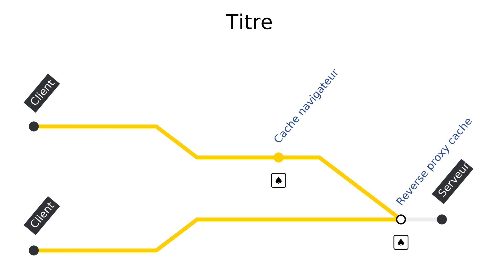

# Le cache HTTP

## poster fade-from
> @00:00:00@

## blank black
> L'autre jour,
> j'étais dans mon canap',
> j'allume la télé et j'me lance dans une activité qu'on connait tous très bien :

## text netflix
> #Bruit de Netflix#
🍿 C'est *quoi* qu'on va <br> regarder sur Netflix *?*
> #Voix de pub#
> Le "C'est quoi qu'on va regarder sur Netflix ?"

## text fade-from
👀 Netflixfilmauswahldurchsuchung
<!-- chercher à travers le choix de films de Netflix -->
> Activité qui a bien entendu son propre mot en allemand...
> mais qui dure souvent...
> un peu trop longtemps.
> Surtout si vous êtes plusieurs à choisir et que vous cumulez what mille abonements à d'autres services.
> Bref, après 20min de négo, vous choisissez un film trop long...

## blank black
> ...et il est trop tard pour le lancer.

## media white

> #Voix pédante#
> Dans les années 90, j'avais pas ce problème.

<!-- https://unsplash.com/photos/6Nbo9Pn0yJA -->
## media

> On allait au vidéoclub, mais malgré les conseils d'un être humain bien plus pertinent que ceux d'un algo,
> une fois sur deux j'revenais avec la VHS de...

<!-- https://www.themoviedb.org/t/p/original/wFbgPZA44apfPt5wWPinQvV2Pbs.png -->
## media logo black

> "Retour vers le Futur II".
> C'était simple et efficace, mais...

## subway videostore stop=0
> fallait s'taper l'aller/retour et le vidéoclub il était,

## subway videostore stop=3
> très...

## subway videostore stop=4
> très...

## subway videostore stop=7
> très...

## subway videostore stop=9
> très...

## subway videostore stop=10
> loin !
> Non ça aurait été vachement mieux si sur la route du retour vers mon canapé,
> j'avais pu garder une copie de la cassette et la poser...

## subway videostore stop=10
1. Étagère
> ... sur l'étagère par exemple.
> Du coup,

## subway videostore stop=0
1. Étagère
> quand je veux revoir le film,

## subway videostore stop=1 fade-from
1. Étagère
> pas besoin de fair l'aller/retour complet.
> Mais bon,

## blank black
> vous êtes pas venus ici pour savoir si oui où non j'ai fini par brancher ensemble les deux magnétoscopes de la maison.

## poster
> @00:01:30@
> Bonjour à *toutes* et à tous !
> J'm'appelle Hubert Sablonnière,
> J'suis développeur Web chez *Clever Cloud* et aujourd'hui, j'ai envie de vous parler du cache HTTP.
> #Pause#
> On va s'faire un p'tit "retour aux sources" avec de la théorie, des démos et des conseils,
> avec :
> * des rappels pour certains,
> * et quelques découvertes pour tout le monde.
> #Pause#

## text
🗓️ Mai *1996*
> En mai 96,
> Pendant que j'faisais mumuse avec mon cache à base de cassettes vierges,

## media

> Tim Berners Lee, le papa du Web,

## media

> Roy Fielding, le papa de REST

## media

> et Henrik Frystyk Nielsen, le papa du...
> #hésitation#
> jaune et du Comic Sans ?
> publiaient la...

## media

> ...RFC 1945 : HTTP 1.0
> Et ça, ça pète la classe !
> Dans cette version, on retrouve déjà, certains principes de base du cache HTTP.

<!-- ## media -->
<!--  -->
<!-- > Le reste sera complété par HTTP/1.1 par 2 RFC, en 1997, -->

<!-- ## media -->
<!--  -->
<!-- > puis en 1999. -->

## subway
> Un client, un serveur

## subway pop
6. Cache
> et un intermédiaire

## subway pop
0. 🚃
6. Cache
> Le client envoie une requête HTTP,

## subway stop=6
6. Cache 🚃
> elle passe par le cache,
> rien à signaler,

## subway stop=10
6. Cache
10. 🚃
> puis arrive au serveur.

## subway stop=10
6. Cache
10. 🚃♠️
> Le serveur génère une réponse,

## subway stop=10
6. Cache 🚃♠️
> sur le chemin du retour,
> la réponse est cachée, au sens "mise en cache",

## subway stop=10
0. 🚃♠️
6. Cache ♠️
> puis elle arrive à son destinataire.

## subway
6. Cache ♠️
> Du coup, si le client refait la

## subway
0. 🚃
6. Cache ♠️
> même requête HTTP,

## subway stop=6
6. Cache 🚃♠️
> elle arrive au cache et...

## subway stop=6
0. 🚃♠️
6. Cache ♠️
> ...pas besoin d'aller plus loin pour obtenir une réponse.

## text
🤔 À quoi ça sert ?
> OK, mais à quoi ça sert le cache HTTP ?

## blank
> Le premier avantage, c'est qu'en rapprochant la source de la réponse,
> on vient...

## list current=1
Réduire le chargement côté client
Réduire la charge côté serveur
Meilleures perfs = meilleur business
> ...réduire les temps de chargement côté client.
> Le deuxième avantage, c'est qu'avec différentes couches de cache qui peuvent répondre à la place du serveur,
> on vient créer un bouclier qui...

## list current=2
Réduire le chargement côté client
Réduire la charge côté serveur
Meilleures perfs = meilleur business
> ...réduit la charge côté serveur.

## list current=3
Réduire le chargement côté client
Réduire la charge côté serveur
Meilleures perfs = meilleur business
> Dans les deux cas, c'est censé améliorer les performances
> et donc améliorer l'expérience utilisateur,
> les factures mobiles des clients
> et les factures du serveur.

## text
🤯 C'est compliqué
> Le problème c'est que le cache, c'est compliqué.
> À force de vouloir trop cacher sans forcément connaitre et comprendres les règles,
> on se retrouve tôt où tard à dire à un utilisateur :

## lapin
Attention !
<br>
N'oublie pas de vider ton cache, tu risques d'afficher un contenu trop vieux.
> "t'as essayé de vider ton cache ?", ça devrait résoudre le bug.
> Pour éviter cette histoire,
> c'est important de bien comprendre

## text
🤔 Comment ça marche ?
> comment ça marche.

## text
💆‍♀️ Une histoire d'*en-tête*

## code
```http
cache-control: max-age=?
cache-control: no-cache
cache-control: no-store
cache-control: must-revalidate
cache-control: immutable
cache-control: private
cache-control: public
cache-control: s-maxage=?
cache-control: proxy-revalidate
cache-control: stale-while-revalidate=?
cache-control: stale-if-error=?
cache-control: no-transform
```

## code
```http
etag: "183d1fe5a48-87c"
if-none-match: "183d1fe5a48-87c"
```
```http
last-modified: Fri, 21 Oct 2022 11:20:10 GMT
if-modified-since: Fri, 21 Oct 2022 11:20:10 GMT
```
```http
vary: Accept-Encoding
```

## text
🔗 Une histoire de *sources*
> mais aussi de comment sont écrits les sources HTML, CSS, JS...

## text
🤝
Frontend *&* backend
> c'est donc à la fois une affaire de front et de back


## text
🤝
Devs *&* ops

<!-- 
## text
🫶 <br> *Tout le monde* a besoin de cache
 -->

## blank

<!-- https://www.rfc-editor.org/rfc/rfc9111#name-overview-of-cache-operation
Although caching is an entirely OPTIONAL feature of HTTP, it can be assumed that reusing a cached response is desirable and that such reuse is the default behavior when no requirement or local configuration prevents it. Therefore, HTTP cache requirements are focused on preventing a cache from either storing a non-reusable response or reusing a stored response inappropriately, rather than mandating that caches always store and reuse particular responses. -->

## code
```http label="⬅️ Réponse HTTP"
cache-control: ...
```
> l'en-tête le plus important, c'est cache-control
> il peut être utilisé dans une requête ou dans une réponse
> on va surtout parler de son usage dans une réponse
> en valeur de cache-control, on va pouvoir mettre une ou plusieurs directive séparées par des virgules

## code
```http label="⬅️ Réponse HTTP"
cache-control: max-age=[secondes]
```
> la directive la plus utile, c'est max-age=[secondes]

## text
🫵 <br>~C'est *pas* impératif~
> on ne peut pas vraiment dire à un navigateur cache moi ça
> encore moins cache moi ça pendant X secondes
> c'est pas impératif

## text
⏱️ ~*Cache ça* pendant X secondes~
> C'est pas impératif
> Ça ne veut pas dire "cache ça pendant X secondes"

## text
🙏 C'est *déclaratif*
> c'est déclaratif
> on peut lui dire "tu as le droit" et "tu n'as pas le droit"
> un cache peut décider à n'importe quel moment de virer une ressource (fréquence des demandes, tailles du disque...)

## code
```http label="⬅️ Réponse HTTP"
cache-control: max-age=[secondes]
```

## text
✅ Tu as le *droit* de cacher ça

## text
👍️ *Frais* +pendant+ X secondes
> ça veut dire "tu as le droit de cacher ça", "considère que c'est frais pendant X secondes" et "considère que c'est périmé > après X secondes"
> les x secondes sont calculées par rapport à l'en tête date

## text
✋ *Périmé* +après+ X secondes

## code
```http label="⬅️ Réponse HTTP"
date: Fri, 21 Oct 2022 11:12:13 GMT
cache-control: max-age=[secondes]
```

## demo

## demo
_
terminal Serveur HTTP

## demo
firefox Firefox 105
terminal Serveur HTTP
> Expliquer le setup des démos

## text
🤔 On fait quoi quand c'est *périmé* ?
> il se passe quoi quand un élément qui est dans le cache est périmé ?

## demo
firefox Firefox 105
terminal Serveur HTTP
> le navigateur ne le supprime pas instantanément
> il peut décider de le garder en cache 
> montrer about:cache
> il a ses propre règles pour savoir quand virer des trucs et pourquoi

## text
🤙 *Revalidation* avec le serveur
> quand c'est périmé, il doit faire une requête de validation pour savoir si ce qu'il a en cache peut-être utilisé

## code
```http label="⬅️ Réponse HTTP"
etag: "183d1fe5a48-87c"
```
```http label="Requête HTTP ➡️" hide
if-none-match: "183d1fe5a48-87c"
```

## code
```http label="Requête HTTP ➡️"
GET /index.html
```
```http label="⬅️ Réponse HTTP" hide
200 OK
etag: "183d1fe5a48-87c"
```

## code
```http label="Requête HTTP ➡️"
GET /index.html
```
```http label="⬅️ Réponse HTTP"
200 OK
etag: "183d1fe5a48-87c"
```

## blank

## code
```http label="Requête HTTP ➡️"
GET /index.html
if-none-match: "183d1fe5a48-87c"
```
```http label="⬅️ Réponse HTTP" hide
304 Not Modified
etag: "183d1fe5a48-87c"
```

## code
```http label="Requête HTTP ➡️"
GET /index.html
if-none-match: "183d1fe5a48-87c"
```
```http label="⬅️ Réponse HTTP"
304 Not Modified
etag: "183d1fe5a48-87c"
```
> weak etag vs strong etag
> lien avec les range requests

## todo
schéma avec etag (et last modified)

## demo
firefox Firefox 105
terminal Serveur HTTP

## code
```http label="⬅️ Réponse HTTP"
last-modified: Fri, 21 Oct 2022 11:20:10 GMT
```
```http label="Requête HTTP ➡️" hide
if-modified-since: Fri, 21 Oct 2022 11:20:10 GMT
```

## code
```http label="⬅️ Réponse HTTP"
last-modified: Fri, 21 Oct 2022 11:20:10 GMT
```
```http label="Requête HTTP ➡️"
if-modified-since: Fri, 21 Oct 2022 11:20:10 GMT
```

## demo
firefox Firefox 105
terminal Serveur HTTP

## text
<!-- 😬 Cache *heuristique* -->
🙈 Cache *heuristique*
> si tu n'as que des last-modified
> et pas de cache control
> un cache peut rentrer en mode "heuristique"
> et considérer la réponse fraiche pendant pas plus que 10% de maintenant - last modified

## demo
firefox Firefox 105
terminal Serveur HTTP

## text
🤙 *Forcer* la revalidation

## code
```http label="Requête HTTP ➡️"
cache-control: max-age=0
```

<!-- https://stackoverflow.com/questions/1046966/whats-the-difference-between-cache-control-max-age-0-and-no-cache -->
<!-- Semantically; not much. It's shorter, though. – Mark Nottingham Apr 20, 2013 at 7:08 -->
<!-- https://web.archive.org/web/20140811162719/http://palizine.plynt.com/issues/2008Jul/cache-control-attributes/ -->
## code
```http label="⬅️ Réponse HTTP"
cache-control: no-cache
```
> si vous voulez éviter ce comportement
> et forcer une validation
> vous pouvez utilise max-age=0 (mais il parait que chrome fait comme si c'était 10)
> à la place, vous pouvez utiliser no-cache
> no-cache

## lapin
ATTENTION !
<br>
+no-cache+ `!==` pas de cache

## demo
firefox Firefox 105
terminal Serveur HTTP

## text
⛔ Tu n'as *pas le droit* de cacher ça

## code
```http label="⬅️ Réponse HTTP"
cache-control: no-store
```
> à l'inverse si on ne veut pas que le navigateur cache qqchose
> on utilise cache-control: no-store
> avec ça, on lui dit "tu n'as pas le droit de cacher ça"

## demo
firefox Firefox 105
terminal Serveur HTTP

## code
```http label="⬅️ Réponse HTTP"
cache-control: must-revalidate
```
> TODO, il me faut une demo avec nginx
> c'est confus
<!-- * https://almanac.httparchive.org/en/2021/caching
  * Driving more awareness around using these directives, for example during larger conferences, could help avoid accidentally wasted bytes.
  * C'est qui le plus fort entre max-age=0, no-cache et no-store -->
> https://www.fastly.com/blog/cache-control-wild
> Furthermore, almost 80% of responses with must-revalidate also included no-cache or no-store, which override it. I suspect this is because a lot of folks aren’t sure what different directives do, so they “throw the kitchen sink” at caches.

## demo

## code
```http label="⬅️ Réponse HTTP"
cache-control: immutable
```

## code
```http label="⬅️ Réponse HTTP"
cache-control: max-age=31536000, immutable
```
> mentionner la RFC
> mentionner que ça marche hors ligne mais c'est fragile
> à quel moment parler de noms des fichiers et de cache busting
> article des mise à jour de jake

## demo
webkit WebKitGTK (Safari 15)
terminal Serveur HTTP

## code
```http label="⬅️ Requête HTTP"
cache-control: max-age
```

## demo
firefox Firefox 105
terminal Serveur HTTP

## code
```http label="⬅️ Requête HTTP"
cache-control: no-cache
```

## demo
chromium Chromium 106
terminal Serveur HTTP

<!-- > https://www.rfc-editor.org/rfc/rfc8246
> à priori, la différence, c'est quand tu F5 une page
> avec immutable, ça 304 pas les sous requêtes
> sans immutable, ça 304 les sous requêtes
> sauf chrome qui a déjà un système pour ça ? (WTF)
> https://www.keycdn.com/blog/cache-control-immutable
> https://bugs.chromium.org/p/chromium/issues/detail?id=611416#c12
> Chrome 53/54
> https://blog.chromium.org/2017/01/reload-reloaded-faster-and-leaner-page_26.html -->

## code
```http label="⬅️ Réponse HTTP"
cache-control: stale-while-revalidate=[secondes]
```
> RFC

## code
```http label="⬅️ Réponse HTTP"
cache-control: max-age=604800, stale-while-revalidate=86400
```

## demo
firefox Firefox 105
terminal Serveur HTTP

## code title="En-têtes *obsolètes*"
```http label="⬅️ Requête HTTP" hide
Pragma: no-cache
```
```http label="⬅️ Réponse HTTP" hide
Expires: Fri, 21 Oct 2022 11:12:13 GMT
```

## code title="En-têtes *obsolètes*"
```http label="⬅️ Requête HTTP"
Pragma: no-cache
```
```http label="⬅️ Réponse HTTP" hide
Expires: Fri, 21 Oct 2022 11:12:13 GMT
```

## code title="En-têtes *obsolètes*"
```http label="⬅️ Requête HTTP"
Pragma: no-cache
```
```http label="⬅️ Réponse HTTP"
Expires: Fri, 21 Oct 2022 11:12:13 GMT
```

## todo
un post invalide un get

## text
🕵️‍♀️ Cache *privé* vs. cache *partagé*

## section
Reverse proxy

## subway stop=10
6. Cache navigateur

## subway stop=10 pop
6. Cache navigateur
9. Reverse proxy cache

## subway
6. Cache navigateur
9. Reverse proxy cache

## subway
0. 🚃
6. Cache navigateur
9. Reverse proxy cache

## subway stop=6
6. Cache navigateur 🚃
9. Reverse proxy cache

## subway stop=9
6. Cache navigateur
9. Reverse proxy cache 🚃

## subway stop=10
6. Cache navigateur
9. Reverse proxy cache
10. 🚃

## subway stop=10
6. Cache navigateur
9. Reverse proxy cache
10. 🚃♠️

## subway stop=10
6. Cache navigateur
9. Reverse proxy cache 🚃♠️

## subway stop=10
6. Cache navigateur 🚃♠️
9. Reverse proxy cache ♠️

## subway stop=10
0. 🚃♠️
6. Cache navigateur ♠️
9. Reverse proxy cache ♠️

## subway
6. Cache navigateur ♠️
9. Reverse proxy cache ♠️

## media white


## code
```http label="⬅️ Réponse HTTP"
cache-control: private
```
```http label="⬅️ Réponse HTTP" hide
cache-control: public
```
> TODO transition
> public / privé
> age

## code
```http label="⬅️ Réponse HTTP"
cache-control: private
```
```http label="⬅️ Réponse HTTP"
cache-control: public
```
> TODO transition
> public / privé
> age

## code
```http label="⬅️ Réponse HTTP"
date: Fri, 21 Oct 2022 11:12:13 GMT
age: 122
cache-control: max-age=3600
```
> TODO transition
> public / privé
> age

## section
CDN

## section
Content Delivery <br> +Network+

## subway stop=10
6. Cache navigateur
9. Reverse proxy cache

## subway stop=10 pop
6. Cache navigateur
8. CDN
9. Reverse proxy cache

## subway
6. Cache navigateur
8. CDN
9. Reverse proxy cache

## subway stop=6
6. Cache navigateur
8. CDN
9. Reverse proxy cache

<!-- TODO schéma avec autre client -->
## subway stop=8
6. Cache navigateur
8. CDN
9. Reverse proxy cache

## todo
schéma multi branche

<!-- TODO pourquoi pas en conclusion -->
## text
⚡ *Premières* visites rapides
> autre détails, ça n'est pas qu'une question de 2e visite

## code
```http label="⬅️ Réponse HTTP"
cache-control: s-maxage=[secondes]
```

## code
```http label="⬅️ Réponse HTTP"
cache-control: stale-if-error=[secondes]
```

## code
```http label="⬅️ Réponse HTTP"
cache-control: max-age=604800, stale-if-error=86400
```
> stale-if-error => pas possible de tester dans un navigateur
> stale-if-error => pas possible de tester avec nginx

## demo
firefox Firefox 105
terminal Serveur HTTP

## code
```http label="⬅️ Réponse HTTP"
cdn-cache-control: 
```

## code
```http label="⬅️ Réponse HTTP"
surrogate-control: 
```

## code
```http label="⬅️ Réponse HTTP"
vary: [en-tête]
```

## code
```http label="⬅️ Réponse HTTP"
vary: accept-encoding
```

## todo
schéma vary

## media


## media


## media


## code
```http label="⬅️ Réponse HTTP"
cache-control: no-transform
```

## section
Disk cache

## subway stop=10
6. Cache navigateur
8. CDN
9. Reverse proxy cache

## subway stop=10 pop
6. Disk cache
8. CDN
9. Reverse proxy cache

## section
Memory cache

## subway stop=10
6. Disk cache
8. CDN
9. Reverse proxy cache

## subway stop=10 pop
2. Memory cache
6. Disk cache
8. CDN
9. Reverse proxy cache

## todo
démo ?

## section
Module map

## subway stop=10
2. Memory cache
6. Disk cache
8. CDN
9. Reverse proxy cache

## subway stop=10 pop
2. Memory cache
3. Module map
6. Disk cache
8. CDN
9. Reverse proxy cache

## todo
démo avec 2 modules qui chargent le même

## todo
webpack

## todo
schéma partage entre onglets

## text todo
✂️ Cache *partitioning*

## todo
démo avec des domaines différents

## section
HTTP/2 push cache

## subway stop=10
2. Memory cache
3. Module map
6. Disk cache
8. CDN
9. Reverse proxy cache

## subway stop=10 pop
2. Memory cache
3. Module map
6. Disk cache
7. HTTP/2 push cache
8. CDN
9. Reverse proxy cache

## subway stop=10
2. Memory cache
3. Module map
6. Disk cache
7. ~HTTP/2 push cache~
8. CDN
9. Reverse proxy cache

## todo
démo ?

## section
Appcache

## subway stop=10
2. Memory cache
3. Module map
6. Disk cache
7. ~HTTP/2 push cache~
8. CDN
9. Reverse proxy cache

## subway stop=10 pop
2. Memory cache
3. Module map
5. Appcache
6. Disk cache
7. ~HTTP/2 push cache~
8. CDN
9. Reverse proxy cache

## subway stop=10
2. Memory cache
3. Module map
5. ~Appcache~
6. Disk cache
7. ~HTTP/2 push cache~
8. CDN
9. Reverse proxy cache

## todo
exemple

## todo
article douchebag

## section
Service Worker cache

## subway stop=0
2. Memory cache
3. Module map
4. Service worker cache
6. Disk cache
8. CDN
9. Reverse proxy cache

## subway stop=0
2. Memory cache
3. Module map
5. Appcache
6. Disk cache
8. CDN
9. Reverse proxy cache

## subway stop=0
2. Memory cache
3. Module map
4. Service worker cache
5.X Appcache
6. Disk cache
8. CDN
9. Reverse proxy cache

## todo
schéma service worker

## todo
exemple code service worker

## section
Back/Forward cache

<!-- Bfcache attention a vos script tiers -->

## subway stop=0
1. BF cache
2. Memory cache
3. Module map
4. Service worker cache
5. ~Appcache~
6. Disk cache
7. ~HTTP/2 push cache~
8. CDN
9. Reverse proxy cache

## subway stop=10 title="Navigations normales"
1.X BF cache
2. Memory cache
3. Module map
4. Service worker cache
5. ~Appcache~
6. Disk cache
7. ~HTTP/2 push cache~
8. CDN
9. Reverse proxy cache

## subway stop=1 title="Historique via précédent/suivant"
1. BF cache
2. Memory cache
3. Module map
4. Service worker cache
5. ~Appcache~
6. Disk cache
7. ~HTTP/2 push cache~
8. CDN
9. Reverse proxy cache

## todo
démo
marche pas pour les SPA

## text
🧑‍🍳 Recettes
<!-- * pour les recettes ce chart est parfait -->
  <!-- * https://simonhearne.com/2022/caching-header-best-practices/#general-recommendations -->

## todo
fichiers statiques qui ne changent pas
nom avec hash
(etag)
max-age=31536000,immutable

## todo
page dynamique mais pas de ouf
etag
max-age=600

## todo
page dynamique, pourquoi pas un peu de
etag
max-age=600

## todo
page dynamique
etag
no-cache

## todo
page ultra dynamique
no-store

## todo
si ça compresse
Vary: Accept-Encoding

## todo fade-from
si c'est spécifique à l'utilisateur (API via cookie)
private

## blank black
> TODO

## poster
Merci beaucoup !

## credits

Liens :

* Source des composants : https://github.com/CleverCloud/clever-components
* Smart CDN source : https://github.com/CleverCloud/clever-components-cdn
* UI pour sélectionner : https://components.clever-cloud.com/

Références :

* _ : _

Images :

* Brique métro : https://fr.depositphotos.com/15705561/stock-photo-white-tiled-parisian-metro.html

Polices :

* PT Sans : https://fonts.google.com/specimen/PT+Sans
* Anton : https://fonts.google.com/specimen/Anton
* Yanone Kaffeesatz : https://fonts.google.com/specimen/Yanone+Kaffeesatz
* Parisine : https://www.onlinewebfonts.com/download/d8cc1ca87104135f5cf13444f7490a69

Sons :

* Netflix logo : https://www.youtube.com/watch?v=GV3HUDMQ-F8
* Pop : https://www.youtube.com/watch?v=qUs_Jq6FcQU
