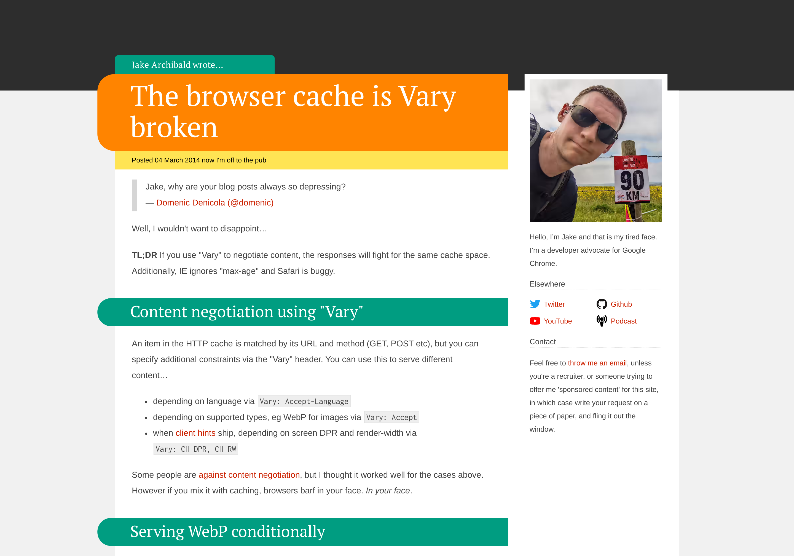
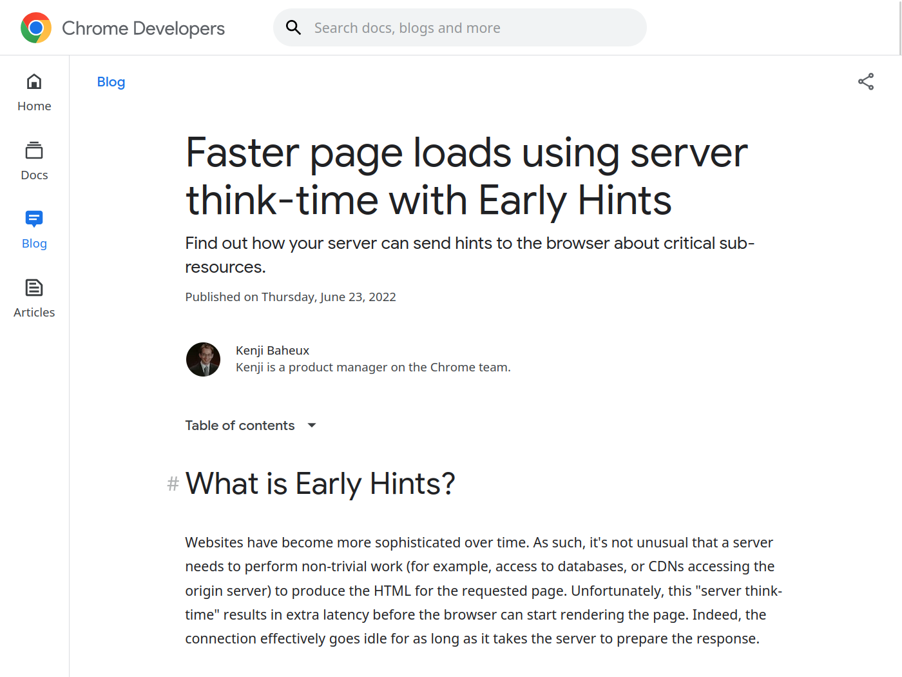
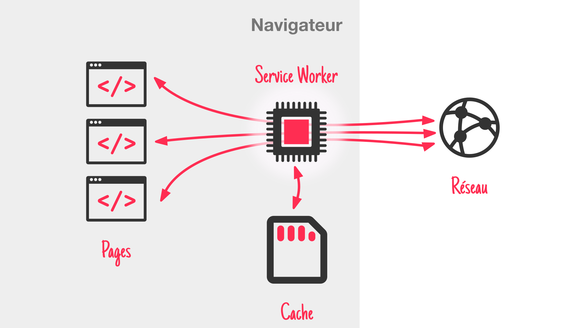

# Le cache HTTP

## poster fade-from
> @00:00:00@

## blank black
> L'autre jour,
> j'étais dans mon canap',
> j'allume la télé et j'me lance dans une activité qu'on connait tous très bien :

## text netflix
> #Bruit de Netflix#
🍿 C'est *quoi* qu'on va <br> regarder sur Netflix *?*
> #Voix de pub#
> Le "C'est quoi qu'on va regarder sur Netflix ?"

## text fade-from
👀 Netflixfilmauswahldurchsuchung
<!-- chercher à travers le choix de films de Netflix -->
> Activité qui a bien entendu son propre mot en allemand...
> mais qui dure souvent ... un peu trop longtemps.
> Surtout si vous êtes plusieurs à choisir et que vous cumulez what mille abonements à d'autres services.
> Bref, après 20min de négo,
> vous choisissez un film trop long...

## blank black
> ...et il est trop tard pour le lancer.

## media white

> #Voix pédante#
> Oui euh, dans les années 90, on avait pas ce problème hann.

<!-- https://unsplash.com/photos/6Nbo9Pn0yJA -->
## media

> Ouais, on allait au vidéoclub, mais malgré les conseils d'un être humain bien plus pertinent que ceux d'un algo,
> moi, une fois sur deux j'revenais avec la VHS de...

<!-- https://www.themoviedb.org/t/p/original/wFbgPZA44apfPt5wWPinQvV2Pbs.png -->
## media logo black

> "Retour vers le Futur II".
> C'était simple et efficace, mais...

## subway videostore stop=0
> fallait s'taper l'aller/retour et le vidéoclub il était,

## subway videostore stop=3
> très...

## subway videostore stop=4
> très...

## subway videostore stop=7
> très...

## subway videostore stop=9
> très...

## subway videostore stop=10
> loin !
> Non ça aurait été vachement mieux si sur la route du retour vers mon canapé,
> j'avais pu garder une copie de la cassette...

## subway videostore stop=10
1. Étagère
> ... sur l'étagère par exemple.
> Du coup,

## subway videostore stop=0
1. Étagère
> quand je veux revoir le film,

## subway videostore stop=1 fade-from
1. Étagère
> pas besoin de faire l'aller/retour complet.
> Mais bon,

## blank black
> vous êtes pas venus ici pour savoir si oui où non j'ai fini par brancher ensemble les deux magnétoscopes de la maison.

## poster
> @00:01:30@
> Bonjour à *toutes* et à tous !
> J'm'appelle Hubert Sablonnière,
> J'suis développeur Web chez *Clever Cloud* et aujourd'hui, j'ai envie de vous parler du cache HTTP.
> #Pause#
> On va s'faire un p'tit "retour aux sources" avec de la théorie, des démos et des conseils,
> il y aura :
> * des rappels pour certains,
> * et quelques découvertes pour tout le monde.

## text
🗓️ Mai *1996*
> En mai 96,
> Pendant que j'faisais mumuse avec mon cache à base de cassettes vierges,

## media

> Tim Berners Lee, le papa du Web,

## media

> Roy Fielding, le papa de REST

## media

> et Henrik Frystyk Nielsen, le papa du...
> #hésitation#
> jaune et du Comic Sans ?
> publiaient la...

## media

> ...RFC 1945 : HTTP 1.0
> Comment ça pète la classe !
> Dans cette version, on retrouve déjà certains principes de base du cache HTTP.

<!-- ## media -->
<!--  -->
<!-- > Le reste sera complété par HTTP/1.1 par 2 RFC, en 1997, -->

<!-- ## media -->
<!--  -->
<!-- > puis en 1999. -->

## subway
> Un client, un serveur

## subway pop
6. Cache
> et un intermédiaire

## subway
0. 🚃
6. Cache
> Le client envoie une requête HTTP,

## subway stop=6
6. Cache 🚃
> elle passe par le cache,
> rien à déclarer,

## subway stop=10
6. Cache
10. 🚃
> puis arrive au serveur.

## subway stop=10
6. Cache
10. 🚃♠️
> Le serveur génère une réponse,

## subway stop=10
6. Cache 🚃♠️
> et sur le chemin du retour,
> la réponse est cachée, au sens "mise en cache",

## subway stop=10
0. 🚃♠️
6. Cache ♠️
> puis elle arrive à son destinataire.

## subway
6. Cache ♠️
> Du coup, si le client refait la

## subway
0. 🚃
6. Cache ♠️
> même requête HTTP,

## subway stop=6
6. Cache 🚃♠️
> elle va jusqu'au cache
> il a la réponse...

## subway stop=6
0. 🚃♠️
6. Cache ♠️
> ...pas besoin d'aller plus loin.

## text
🤔 À quoi ça sert ?
> Cool, mais à quoi ça sert de faire ça ?

## blank
> Le premier avantage, c'est qu'en rapprochant la source de la réponse,
> on vient...

## list current=1
Réduire le chargement côté client
Réduire la charge côté serveur
Meilleures perfs = meilleur business
> ...réduire les temps de chargement côté client.
> Le deuxième avantage, c'est qu'avec différentes couches de cache qui peuvent répondre à la place du serveur,
> on vient créer un bouclier qui...

## list current=2
Réduire le chargement côté client
Réduire la charge côté serveur
Meilleures perfs = meilleur business
> ...réduit la charge côté serveur.

## list current=3
Réduire le chargement côté client
Réduire la charge côté serveur
Meilleures perfs = meilleur business
> Dans les deux cas, c'est censé améliorer les performances
> et donc améliorer l'expérience utilisateur,
> réduire les factures mobiles des clients,
> réduire les factures des serveurs.

## text
🫶 <br> Le *cache* HTTP <br> +c'est la vie+
> Bref, le cache HTTP, c'est la vie mais...

## text
🤯 C'est *compliqué*
> ...c'est compliqué.
> À force de vouloir trop cacher sans forcément connaitre et comprendres les règles,
> on se retrouve tôt où tard à dire à un utilisateur :

## lapin
ATTENTION !
<br>
N'oublie pas de vider ton cache, tu risques d'afficher un contenu trop vieux.
> "t'as essayé de vider ton cache ? ça devrait résoudre le bug"
> Pour éviter cette histoire,
> c'est important de bien comprendre

## text
🧑‍🎓 *Comment* ça marche ?
> comment ça marche,
> et on est là pour ça ;-)

## text
💆‍♀️ Une histoire d'*en-tête*
> Le cache HTTP, c'est d'abord une histoire d'en-tête.

## code
```http
cache-control: max-age=?
cache-control: no-cache
cache-control: no-store
cache-control: must-revalidate
cache-control: immutable
cache-control: stale-while-revalidate=?
cache-control: private
cache-control: public
cache-control: s-maxage=?
cache-control: stale-if-error=?
<!-- cache-control: no-transform -->
```
Des en-têtes qui seront principalement envoyés par le serveur de prod dans des réponses HTTP.

## code
```http
etag: "11aa11aa11-aa"
if-none-match: "11aa11aa11-aa"
```
```http
last-modified: Thu, 20 Oct 2022 11:20:00 GMT
if-modified-since: Thu, 20 Oct 2022 11:20:00 GMT
```
```http
age: 120
```
```http
vary: accept-encoding
```
> Je vais essayer de vous présenter le plus importants.

## text
🔗 Une histoire de *sources*
> C'est aussi une histoire de sources,
> de comment sont nommés vos fichiers HTML, CSS, JS...
> de si vous profitez ou non capacités des navigateurs modernes.

## text
🤝 Frontend *&* backend
> C'est donc à la fois une affaire de front et de back

## text fade-from
🤝 Devs *&* ops
> Ou de devs et d'ops en fonction de qui gère les réglages du serveur.

<!-- ## text -->
<!-- 🫶 <br> *Tout le monde* a besoin de cache -->

## blank black
> @00:05:00@

<!-- https://www.rfc-editor.org/rfc/rfc9111#name-overview-of-cache-operation
Although caching is an entirely OPTIONAL feature of HTTP, it can be assumed that reusing a cached response is desirable and that such reuse is the default behavior when no requirement or local configuration prevents it. Therefore, HTTP cache requirements are focused on preventing a cache from either storing a non-reusable response or reusing a stored response inappropriately, rather than mandating that caches always store and reuse particular responses. -->

## code
```http type="request"
GET /index.html HTTP/1.1
```
```http type="response" hide
HTTP/1.1 200 OK
cache-control: ...
```
```http type="response" hide-height
HTTP/1.1 200 OK
cache-control: max-age=[secondes]
```

## code
```http type="request"
GET /index.html HTTP/1.1
```
```http type="response"
HTTP/1.1 200 OK
cache-control: ...
```
```http type="response" hide-height
HTTP/1.1 200 OK
cache-control: max-age=[secondes]
```
> C'est parti pour un petit tour d'horizon des en-têtes qui entre en jeu dans la gestion du cache
> l'en-tête le plus important, c'est cache-control
> il peut être utilisé dans une requête ou dans une réponse
> on va surtout parler de son usage dans une réponse
> en valeur de cache-control, on va pouvoir mettre une ou plusieurs directive séparées par des virgules

## code
```http type="request"
GET /index.html HTTP/1.1
```
```http type="response"
HTTP/1.1 200 OK
cache-control: max-age=[secondes]
```
```http type="response" hide-height
HTTP/1.1 200 OK
cache-control: max-age=[secondes]
```
> la directive la plus utile, c'est max-age=[secondes]

## text
🫵 <br>~C'est *pas* impératif~
> on ne peut pas vraiment dire à un navigateur cache moi ça
> encore moins cache moi ça pendant X secondes
> c'est pas impératif

## text
⏱️ ~*Cache ça* pendant X secondes~
> C'est pas impératif
> Ça ne veut pas dire "cache ça pendant X secondes"

## text
🙏 C'est *déclaratif*
> c'est déclaratif
> on peut lui dire "tu as le droit" et "tu n'as pas le droit"
> un cache peut décider à n'importe quel moment de virer une ressource (fréquence des demandes, tailles du disque...)

## code
```http type="response"
HTTP/1.1 200 OK
cache-control: max-age=[secondes]
```

## text
✅ Tu as le *droit* de cacher ça

## text
👍️ *Frais* +pendant+ X secondes
> ça veut dire "tu as le droit de cacher ça", "considère que c'est frais pendant X secondes" et "considère que c'est périmé > après X secondes"
> les x secondes sont calculées par rapport à l'en tête date

## text
✋ *Périmé* +après+ X secondes

## code
```http type="response"
HTTP/1.1 200 OK
date: Fri, 21 Oct 2022 11:12:13 GMT
cache-control: max-age=[secondes]
```
> L'age est calculé à partir de l'en-tête date

## demo
> C'est rarement une bonne idée de prendre pour argent comptant ce que dit spec, du coup on va se faire plusieurs petites démos.

## demo
_
terminal Serveur HTTP
> À chaque fois, ou presque, j'aurai un terminal à droite avec un serveur web de test que j'ai créé pour les démos qui logs les requêtes,

## demo
firefox Firefox 105
terminal Serveur HTTP
> et à gauche un navigateur, avec la plupart du temps Firefox, parceque Firefox, c'est bien :p
> * cache vidé => Ctrl+Shift+Suppr
> * accueil des démos
> * ouvrir un onglet
> * ouvrir les devtools
> * montrer qu'on peut choisir les colonnes
> * ouvrir le #cc-ma-10#

## text
🤔 Et quand c'est *périmé* ?
> il se passe quoi quand un élément qui est dans le cache est périmé ?

## demo
firefox Firefox 105
terminal Serveur HTTP
> * Maximiser le firefox
> * Taper la page about:cache et aller voir le cache disque
> => On voit bien la date et la date d'expiration calculée avec 10s de +
> => le navigateur ne le supprime pas tout de suite ce qui est périmé
> il a ses propre règles pour savoir quand virer des trucs et pourquoi
> * Ne pas oublier de re-minimiser le firefox avant de partir

## text
🤙 *Revalidation* avec le serveur
> Il garde la réponse en cache pour pouvoir faire une revalidation avec le serveur la prochaine fois,
> et pour faire des revalidations efficaces, on va se baser sur les...

## text
🏷️ Requête +conditionnelle+ <br> avec *etag*
> requêtes conditionnelles

## code title="*Première* requête"
```http type="request"
GET /index.html HTTP/1.1
```
```http type="response" hide
HTTP/1.1 200 OK
etag: "11aa11aa11-aa"
```

## code title="*Première* requête"
```http type="request"
GET /index.html HTTP/1.1
```
```http type="response"
HTTP/1.1 200 OK
etag: "11aa11aa11-aa"
```

## code title="Requêtes *suivantes*"
```http type="request" hide
GET /index.html HTTP/1.1
if-none-match: "11aa11aa11-aa"
```
```http type="response" hide
HTTP/1.1 200 OK
etag: "11aa11aa11-aa"
```

## code title="Requêtes *suivantes*"
```http type="request"
GET /index.html HTTP/1.1
if-none-match: "11aa11aa11-aa"
```
```http type="response" hide
HTTP/1.1 200 OK
etag: "11aa11aa11-aa"
```

## code title="304 : *pas* de changement"
```http type="request"
GET /index.html HTTP/1.1
if-none-match: "11aa11aa11-aa"
```
```http type="response"
HTTP/1.1 304 Not Modified
etag: "11aa11aa11-aa"
```

## code title="200 : *nouveau* contenu"
```http type="request"
GET /index.html HTTP/1.1
if-none-match: "11aa11aa11-aa"
```
```http type="response"
HTTP/1.1 200 OK
etag: "22bb22bb22-bb"
```
> weak etag vs strong etag
> lien avec les range requests

## demo
firefox Firefox 105
terminal Serveur HTTP
> * clean le serveur
> * ouvrir #etag-simple#
> * constater les requêtes avec 200
> * aller sur un autre site
> * revenir sur #etag-simple#
> * constater les requêtes avec if-none-match envoyées par le client
> * elles sont reçues par le serveur,
> * le etag est le même, donc le serveur renvoie des 304
> avec cette config, le navigateur n'utilisera jamais son cache directement
> il fera tout de suite une revalidation avec le serveur.
> Si on combine un etag avec un cache-control: max-age=10
> on aura bien une période de 10 secondes où le navigateur utilise directement le cache
> et une fois périmé, il déclenche une revalidation

## text
📅 Requête +conditionnelle+ <br> avec *last-modified*
> L'autre manière de faire de la revalidation conditionnelle
> c'est avec des dates

## code title="*Première* requête"
```http type="request"
GET /index.html HTTP/1.1
```
```http type="response" hide
HTTP/1.1 200 OK
last-modified: Thu, 20 Oct 2022 11:20:00 GMT
```

## code title="*Première* requête"
```http type="request"
GET /index.html HTTP/1.1
```
```http type="response"
HTTP/1.1 200 OK
last-modified: Thu, 20 Oct 2022 11:20:00 GMT
```

## code title="Requêtes *suivantes*"
```http type="request" hide
GET /index.html HTTP/1.1
if-modified-since: Thu, 20 Oct 2022 11:20:00 GMT
```
```http type="response" hide
HTTP/1.1 200 OK
last-modified: Thu, 20 Oct 2022 11:20:00 GMT
```

## code title="Requêtes *suivantes*"
```http type="request"
GET /index.html HTTP/1.1
if-modified-since: Thu, 20 Oct 2022 11:20:00 GMT
```
```http type="response" hide
HTTP/1.1 200 OK
last-modified: Thu, 20 Oct 2022 11:20:00 GMT
```

## code title="304 : *pas* de changement"
```http type="request"
GET /index.html HTTP/1.1
if-modified-since: Thu, 20 Oct 2022 11:20:00 GMT
```
```http type="response"
HTTP/1.1 304 Not Modified
last-modified: Thu, 20 Oct 2022 11:20:00 GMT
```

## code title="200 : *nouveau* contenu"
```http type="request"
GET /index.html HTTP/1.1
if-modified-since: Thu, 20 Oct 2022 11:20:00 GMT
```
```http type="response"
HTTP/1.1 200 OK
last-modified: Fri, 21 Oct 2022 06:00:00 GMT
```

## demo
firefox Firefox 105
terminal Serveur HTTP
> * clean le serveur
> * clean le firefox
> * ouvrir #lm-simple#
> * constater les requêtes avec 200
> * aller sur un autre site
> * revenir sur #lm-simple#
> * constater que ça ne fait pas de requête au serveur
> ça utilise le cache
> c'est parce que dans la RFC, ils y a une partie

## text
<!-- 😬 Cache *heuristique* -->
🙈 Cache *heuristique*
> cache heuristique qui dit en gros :
> si un cache a une réponse avec un last-modified mais pas de cache-control
> (donc pas d'expiration explicite)
> on peut calculer une date d'expiration basée sur des "heuristiques" qui sont un peu libre
> la spec dit on ne peux pas considérer une réponse fraiche + de 10% de son age
> tu reçois une réponse, elle a un last-modified d'il y a 10 mois
> tu peux la considérer fraîche pendant maximum 1 mois
> après, c'est un peu aléatoire

## demo
firefox Firefox 105
terminal Serveur HTTP
> montrer les last-modified différents dans les devtools
> montrer #about:cache#
> expliquer que le last-modified est étrange
> montrer qu'il y a une date d'expiration calculée
> c'est un peu risqué

## text
🤙 *Forcer* la revalidation
> C'est à mon avis mieux de maitriser la revalidation

## code
```http type="request"
GET /index.html HTTP/1.1
```
```http type="response" hide
HTTP/1.1 200 OK
cache-control: max-age=0
```

## code
```http type="request"
GET /index.html HTTP/1.1
```
```http type="response"
HTTP/1.1 200 OK
cache-control: max-age=0
```

<!-- https://stackoverflow.com/questions/1046966/whats-the-difference-between-cache-control-max-age-0-and-no-cache -->
<!-- Semantically; not much. It's shorter, though. – Mark Nottingham Apr 20, 2013 at 7:08 -->
<!-- https://web.archive.org/web/20140811162719/http://palizine.plynt.com/issues/2008Jul/cache-control-attributes/ -->


## code
```http type="request"
GET /index.html HTTP/1.1
```
```http type="response"
HTTP/1.1 200 OK
cache-control: no-cache
```
> si vous voulez éviter ce comportement
> et forcer une validation
> vous pouvez utilise max-age=0
> à la place, vous pouvez utiliser no-cache

## lapin
ATTENTION !
<br>
+no-cache+ `!==` pas de cache

## text
✅ Tu as le *droit* de cacher ça,

## text
🤙 mais tu revalides *tout le temps*

## demo
firefox Firefox 105
terminal Serveur HTTP
> montrer #lm-nc#

## blank

## code
```http type="request"
GET /index.html HTTP/1.1
```
```http type="response" hide
HTTP/1.1 200 OK
cache-control: no-store
```

## code
```http type="request"
GET /index.html HTTP/1.1
```
```http type="response"
HTTP/1.1 200 OK
cache-control: no-store
```
> à l'inverse si on ne veut pas que le navigateur cache qqchose
> on utilise cache-control: no-store
> avec ça, on lui dit "tu n'as pas le droit de cacher ça"

## text
⛔ Tu n'as *pas le droit* de cacher ça

## demo
firefox Firefox 105
terminal Serveur HTTP
> * vider tout le cache
> * montrer le cache vide
> * lancer #cc-ns#
> * montrer le cache vide

## blank

## code
```http type="request"
GET /index.html HTTP/1.1
```
```http type="response" hide
HTTP/1.1 200 OK
cache-control: must-revalidate
```
```http type="response" hide-height
HTTP/1.1 200 OK
cache-control: max-age=60, must-revalidate
```

## code
```http type="request"
GET /index.html HTTP/1.1
```
```http type="response"
HTTP/1.1 200 OK
cache-control: must-revalidate
```
```http type="response" hide-height
HTTP/1.1 200 OK
cache-control: max-age=60, must-revalidate
```

## code
```http type="request"
GET /index.html HTTP/1.1
```
```http type="response"
HTTP/1.1 200 OK
cache-control: max-age=60, must-revalidate
```
```http type="response" hide-height
HTTP/1.1 200 OK
cache-control: max-age=60, must-revalidate
```

## text
🤙 Revalide +si+ c'est *périmé*

## demo nodemo

<!-- * https://almanac.httparchive.org/en/2021/caching
  * Driving more awareness around using these directives, for example during larger conferences, could help avoid accidentally wasted bytes.
  * C'est qui le plus fort entre max-age=0, no-cache et no-store -->
<!-- > https://www.fastly.com/blog/cache-control-wild -->
<!-- > Furthermore, almost 80% of responses with must-revalidate also included no-cache or no-store, which override it. I suspect this is because a lot of folks aren’t sure what different directives do, so they “throw the kitchen sink” at caches. -->

## blank

## code
```http type="request"
GET /index.css HTTP/1.1
```
```http type="response" hide
HTTP/1.1 200 OK
cache-control: immutable
```
```http type="response" hide-height
HTTP/1.1 200 OK
cache-control: max-age=31536000, immutable
```

## code
```http type="request"
GET /index.css HTTP/1.1
```
```http type="response"
HTTP/1.1 200 OK
cache-control: immutable
```
```http type="response" hide-height
HTTP/1.1 200 OK
cache-control: max-age=31536000, immutable
```

## code
```http type="request"
GET /index.css HTTP/1.1
```
```http type="response"
HTTP/1.1 200 OK
cache-control: max-age=31536000, immutable
```
```http type="response" hide-height
HTTP/1.1 200 OK
cache-control: max-age=31536000, immutable
```
> mentionner la RFC
> mentionner que ça marche hors ligne mais c'est fragile
> à quel moment parler de noms des fichiers et de cache busting
> article des mise à jour de jake

## text
🔄 *Pas* de revalidation <br> en cas de +rechargement+

## demo
webkit WebKitGTK (Safari 15)
terminal Serveur HTTP

## demo
chromium Chromium 106
terminal Serveur HTTP

## demo
firefox Firefox 105
terminal Serveur HTTP

<!-- ## code
```http label="⬅️ Requête HTTP"
cache-control: max-age
``` -->

<!-- ## code
```http label="⬅️ Requête HTTP"
cache-control: no-cache
``` -->

## code title="*Longue* expiration"
```http type="request"
GET /index.css HTTP/1.1
```
```http type="response"
HTTP/1.1 200 OK
cache-control: max-age=31536000, immutable
```

## code title="cache busting"
```http type="request"
GET /index.abe2cd5f.css HTTP/1.1
```
```http type="response"
HTTP/1.1 200 OK
cache-control: max-age=31536000, immutable
```

## code title="revving"
```http type="request"
GET /index.f30a31cc.css HTTP/1.1
```
```http type="response"
HTTP/1.1 200 OK
cache-control: max-age=31536000, immutable
```

## code title="versionning"
```http type="request"
GET /index.de0ab12e.css HTTP/1.1
```
```http type="response"
HTTP/1.1 200 OK
cache-control: max-age=31536000, immutable
```

## code title="*empreinte* dans le +nom du fichier+"
```http type="request"
GET /index.2cac1992.css HTTP/1.1
```
```http type="response"
HTTP/1.1 200 OK
cache-control: max-age=31536000, immutable
```

<!-- > https://www.rfc-editor.org/rfc/rfc8246
> à priori, la différence, c'est quand tu F5 une page
> avec immutable, ça 304 pas les sous requêtes
> sans immutable, ça 304 les sous requêtes
> sauf chrome qui a déjà un système pour ça ? (WTF)
> https://www.keycdn.com/blog/cache-control-immutable
> https://bugs.chromium.org/p/chromium/issues/detail?id=611416#c12
> Chrome 53/54
> https://blog.chromium.org/2017/01/reload-reloaded-faster-and-leaner-page_26.html -->

## blank

## code
```http type="request"
GET /avatar.jpg HTTP/1.1
```
```http type="response" hide
HTTP/1.1 200 OK
cache-control: stale-while-revalidate=[secondes]
```
```http type="response" hide-height
HTTP/1.1 200 OK
cache-control: max-age=3600, stale-while-revalidate=60
```

## code
```http type="request"
GET /avatar.jpg HTTP/1.1
```
```http type="response"
HTTP/1.1 200 OK
cache-control: stale-while-revalidate=[secondes]
```
```http type="response" hide-height
HTTP/1.1 200 OK
cache-control: max-age=3600, stale-while-revalidate=60
```
> RFC

## text
✅ Tu as le *droit* de servir du périmé <br> +pendant+ X secondes,

## text
🤙 mais en *parallèle* <br> tu +revalides+

## code
```http type="request"
GET /avatar.jpg HTTP/1.1
```
```http type="response"
HTTP/1.1 200 OK
cache-control: max-age=3600, stale-while-revalidate=60
```
```http type="response" hide-height
HTTP/1.1 200 OK
cache-control: max-age=3600, stale-while-revalidate=60
```

## demo
firefox Firefox 105
terminal Serveur HTTP

## blank

## code title="En-têtes *obsolètes*"
```http type="request"
GET /index.html HTTP/1.1
Pragma: no-cache
```

## code title="En-têtes *obsolètes*"
```http type="response"
HTTP/1.1 200 OK
Expires: Fri, 21 Oct 2022 11:12:13 GMT
```

## blank

<!-- ## text
un post invalide un get -->

## subway stop=10
6. Cache navigateur
> @00:23:30@

## text
🕵️‍♀️ Caches *privés* vs. cache *partagés*

## section
Reverse proxy cache

## subway stop=10
6. Cache navigateur

## subway stop=10 pop
6. Cache navigateur
9. Reverse proxy cache

<!-- ## subway stop=9
6. Cache navigateur
9. Reverse proxy cache -->

## section
CDN

## section
Content Delivery <br> +Network+

## subway stop=10
6. Cache navigateur
9. Reverse proxy cache

## subway stop=10 pop
6. Cache navigateur
8. CDN
9. Reverse proxy cache

## subway
0. 🚃
6. Cache navigateur
8. CDN
9. Reverse proxy cache

## subway stop=6
6. Cache navigateur 🚃
8. CDN
9. Reverse proxy cache

## subway stop=8
6. Cache navigateur
8. CDN 🚃
9. Reverse proxy cache

## subway stop=9
6. Cache navigateur
8. CDN
9. Reverse proxy cache 🚃

## subway stop=10
6. Cache navigateur
8. CDN
9. Reverse proxy cache
10. 🚃

## subway stop=10
6. Cache navigateur
8. CDN
9. Reverse proxy cache
10. 🚃♠️

## subway stop=10
6. Cache navigateur
8. CDN
9. Reverse proxy cache 🚃♠️

## subway stop=10
6. Cache navigateur
8. CDN 🚃♠️
9. Reverse proxy cache ♠️

## subway stop=10
6. Cache navigateur 🚃♠️
8. CDN ♠️
9. Reverse proxy cache ♠️

## subway stop=10
0. 🚃♠️
6. Cache navigateur ♠️
8. CDN ♠️
9. Reverse proxy cache ♠️

## subway
6. Cache navigateur ♠️
8. CDN ♠️
9. Reverse proxy cache ♠️

## media white


## media white


## text
⚡ *Premières* visites rapides
> autre détails, ça n'est pas qu'une question de 2e visite

## code
```http type="response"
HTTP/1.1 200 OK
date: Fri, 21 Oct 2022 11:12:13 GMT
age: 120
cache-control: max-age=3600
```
> public / privé
> age

## code title="Caches *privés* uniquement"
```http type="request"
GET /profile.html HTTP/1.1
cookie: session-id=42
```
```http type="response" hide
HTTP/1.1 200 OK
cache-control: [...], private
```

## code title="Caches *privés* uniquement"
```http type="request"
GET /profile.html HTTP/1.1
cookie: session-id=42
```
```http type="response"
HTTP/1.1 200 OK
cache-control: [...], private
```

## code title="Caches *privés* uniquement"
```http type="request"
GET /profile.html HTTP/1.1
authorization: Basic YWRtaW46YWRtaW4=
```
```http type="response"
HTTP/1.1 200 OK
```

## code title="Caches *privés* uniquement"
```http type="request"
GET /about.html HTTP/1.1
authorization: Basic YWRtaW46YWRtaW4=
```
```http type="response" hide
HTTP/1.1 200 OK
cache-control: [...], private
```

## code title="Caches *privés* +et+ *partagés*"
```http type="request"
GET /about.html HTTP/1.1
authorization: Basic YWRtaW46YWRtaW4=
```
```http type="response"
HTTP/1.1 200 OK
cache-control: [...], public
```
> public / privé
> age

## blank

## code title="Caches *privés* +et+ *partagés*"
<!-- ## code title="Caches *privés* uniquement" -->
```http type="request"
GET /index.html HTTP/1.1
```
```http type="response"
HTTP/1.1 200 OK
cache-control: max-age=60
```

## code title="Caches *partagés* uniquement"
<!-- ## code title="Caches *privés* uniquement" -->
```http type="request"
GET /index.html HTTP/1.1
```
```http type="response"
HTTP/1.1 200 OK
cache-control: s-maxage=60
```

## code title="Combinaisons"
<!-- ## code title="Caches *privés* uniquement" -->
```http type="request"
GET /index.html HTTP/1.1
```
```http type="response"
HTTP/1.1 200 OK
cache-control: max-age=60, s-maxage=3600
```

## code title="Combinaisons"
<!-- ## code title="Caches *privés* uniquement" -->
```http type="request"
GET /index.html HTTP/1.1
```
```http type="response"
HTTP/1.1 200 OK
cache-control: no-cache, s-maxage=3600
```

## blank

## code
```http type="request"
GET /index.html HTTP/1.1
```
```http type="response"
HTTP/1.1 200 OK
cache-control: stale-if-error=[secondes]
```
```http type="response" hide-height
HTTP/1.1 200 OK
cache-control: max-age=60, stale-if-error=86400
```

## text
✅ Tu as le *droit* de servir du périmé <br> +si tu reçois+ une erreur

## code
```http type="request"
GET /index.html HTTP/1.1
```
```http type="response"
HTTP/1.1 200 OK
cache-control: max-age=60, stale-if-error=86400
```
```http type="response" hide-height
HTTP/1.1 200 OK
cache-control: max-age=60, stale-if-error=86400
```

## code
```http type="request"
GET /index.html HTTP/1.1
```
```http type="response"
HTTP/1.1 200 OK
cache-control: max-age=60, stale-while-revalidate=3600, stale-if-error=86400
```
> stale-if-error => pas possible de tester dans un navigateur
> stale-if-error => pas possible de tester avec nginx

## code
```http type="response"
HTTP/1.1 200 OK
cdn-cache-control: ...
```

## code
```http type="response"
HTTP/1.1 200 OK
cloudflare-cdn-cache-control: ...
```

## code
```http type="response"
HTTP/1.1 200 OK
surrogate-control: ...
```

## code fade-from
```http type="response"
HTTP/1.1 200 OK
X-Accel-Expires: [secondes]
```

## blank black

## code
```http type="response"
vary: .............
```
> @00:34:00@

## lapin
ATTENTION !
<br>
Ne mets pas tes mains dans +vary+, tu vas te pincer très fort.

## demo

## demo
firefox Firefox 105
chromium Chromium 106
terminal Serveur HTTP
> * charger la page dans firefox
> * montrer l'en-tête accept language
> * charger la page dans chrome
> * montrer l'en-tête accept language
> expliquer que ma page dynamique se base la dessus
> * démarrer le nginx
> * passer en mode :8888
> * afficher dans firefox puis dans chrome
> * expliquer qu'on profite du cache partagé

## media


## media


## code title="+Utiliser+ avec la *compression*"
```http type="response"
vary: accept-encoding
```
> explication des clés cache

## media


<!-- ## code
```http type="response"
cache-control: no-transform
``` -->

## section
Disk cache
> @00:38:00@

## subway stop=10
6. Cache navigateur
8. CDN
9. Reverse proxy cache

## subway stop=10 pop
6. Disk cache
8. CDN
9. Reverse proxy cache

## section
Memory cache

## subway stop=10
6. Disk cache
8. CDN
9. Reverse proxy cache

## subway stop=10 pop
2. Memory cache
6. Disk cache
8. CDN
9. Reverse proxy cache

## demo
firefox Firefox 105
chromium Chromium 106
> montrer avec une navigation et avec un autre site entre les deux
> si je reste dans la même page ou le même site
> si j'affiche plusieurs fois la même image

## section
Module map

## subway stop=10
2. Memory cache
6. Disk cache
8. CDN
9. Reverse proxy cache

## subway stop=10 pop
2. Memory cache
3. Module map
6. Disk cache
8. CDN
9. Reverse proxy cache

## code
```js
// page-foo.js
import { groupBy } from './utils.js';
```
```js hide
// page-bar.js
import { camelCase } from './utils.js';
```

## code
```js
// page-foo.js
import { groupBy } from './utils.js';
```
```js
// page-bar.js
import { camelCase } from './utils.js';
```

## code
```js tiny
(()=>{var e,t,r={},o={};function n(e){var t=o[e];if(void 0!==t)return t.exports;var a=o[e]={exports:{}};return r[e](a,a.exports,n),a.exports}n.m=r,n.d=(e,t)=>{for(var r in t)n.o(t,r)&&!n.o(e,r)&&Object.defineProperty(e,r,{enumerable:!0,get:t[r]})},n.f={},n.e=e=>Promise.all(Object.keys(n.f).reduce(((t,r)=>(n.f[r](e,t),t)),[])),n.u=e=>e+".bundle.webpack.js",n.g=function(){if("object"==typeof globalThis)return globalThis;try{return this||new Function("return this")()}catch(e){if("object"==typeof window)return window}}(),n.o=(e,t)=>Object.prototype.hasOwnProperty.call(e,t),e={},t="test-webpack:",n.l=(r,o,a,i)=>{if(e[r])e[r].push(o);else{var c,u;if(void 0!==a)for(var l=document.getElementsByTagName("script"),s=0;s<l.length;s++){var d=l[s];if(d.getAttribute("src")==r||d.getAttribute("data-webpack")==t+a){c=d;break}}c||(u=!0,(c=document.createElement("script")).charset="utf-8",c.timeout=120,n.nc&&c.setAttribute("nonce",n.nc),c.setAttribute("data-webpack",t+a),c.src=r),e[r]=[o];var p=(t,o)=>{c.onerror=c.onload=null,clearTimeout(f);var n=e[r];if(delete e[r],c.parentNode&&c.parentNode.removeChild(c),n&&n.forEach((e=>e(o))),t)return t(o)},f=setTimeout(p.bind(null,void 0,{type:"timeout",target:c}),12e4);c.onerror=p.bind(null,c.onerror),c.onload=p.bind(null,c.onload),u&&document.head.appendChild(c)}},n.r=e=>{"undefined"!=typeof Symbol&&Symbol.toStringTag&&Object.defineProperty(e,Symbol.toStringTag,{value:"Module"}),Object.defineProperty(e,"__esModule",{value:!0})},(()=>{var e;n.g.importScripts&&(e=n.g.location+"");var t=n.g.document;if(!e&&t&&(t.currentScript&&(e=t.currentScript.src),!e)){var r=t.getElementsByTagName("script");r.length&&(e=r[r.length-1].src)}if(!e)throw new Error("Automatic publicPath is not supported in this browser");e=e.replace(/#.*$/,"").replace(/\?.*$/,"").replace(/\/[^\/]+$/,"/"),n.p=e})(),(()=>{var e={179:0};n.f.j=(t,r)=>{var o=n.o(e,t)?e[t]:void 0;if(0!==o)if(o)r.push(o[2]);else{var a=new Promise(((r,n)=>o=e[t]=[r,n]));r.push(o[2]=a);var i=n.p+n.u(t),c=new Error;n.l(i,(r=>{if(n.o(e,t)&&(0!==(o=e[t])&&(e[t]=void 0),o)){var a=r&&("load"===r.type?"missing":r.type),i=r&&r.target&&r.target.src;c.message="Loading chunk "+t+" failed.\n("+a+": "+i+")",c.name="ChunkLoadError",c.type=a,c.request=i,o[1](c)}}),"chunk-"+t,t)}};var t=(t,r)=>{var o,a,[i,c,u]=r,l=0;if(i.some((t=>0!==e[t]))){for(o in c)n.o(c,o)&&(n.m[o]=c[o]);u&&u(n)}for(t&&t(r);l<i.length;l++)a=i[l],n.o(e,a)&&e[a]&&e[a][0](),e[a]=0},r=self.webpackChunktest_webpack=self.webpackChunktest_webpack||[];r.forEach(t.bind(null,0)),r.push=t.bind(null,r.push.bind(r))})(),addEventListener("router",(async e=>{if("foo"===e.route){const{render:e}=await n.e(214).then(n.bind(n,214));e()}if("bar"===e.route){const{render:e}=await n.e(568).then(n.bind(n,568));e()}}))})();
```

## section
HTTP/2 push cache

## subway stop=10
2. Memory cache
3. Module map
6. Disk cache
8. CDN
9. Reverse proxy cache

## subway stop=10 pop
2. Memory cache
3. Module map
6. Disk cache
7. HTTP/2 push cache
8. CDN
9. Reverse proxy cache

## subway stop=10
2. Memory cache
3. Module map
6. Disk cache
7.X ~HTTP/2 push cache~
8. CDN
9. Reverse proxy cache

## media

> early hints

## section
Appcache

## subway stop=10
2. Memory cache
3. Module map
6. Disk cache
7.X ~HTTP/2 push cache~
8. CDN
9. Reverse proxy cache

## subway stop=10 pop
2. Memory cache
3. Module map
5. Appcache
6. Disk cache
7.X ~HTTP/2 push cache~
8. CDN
9. Reverse proxy cache

## subway stop=10
2. Memory cache
3. Module map
5.X ~Appcache~
6. Disk cache
7.X ~HTTP/2 push cache~
8. CDN
9. Reverse proxy cache

<!-- ## text
exemple -->

## media


## section
Service Worker cache

## media white


## media 


## subway stop=10
2. Memory cache
3. Module map
5.X ~Appcache~
7.X ~HTTP/2 push cache~
6. Disk cache
8. CDN
9. Reverse proxy cache

## subway stop=10 pop
2. Memory cache
3. Module map
4. Service worker cache
5.X ~Appcache~
6. Disk cache
7.X ~HTTP/2 push cache~
8. CDN
9. Reverse proxy cache

## media white


<!-- ## media white -->
<!--  -->

## text
✂️ Cache *partitioning*

## demo
firefox Firefox 105

## section
Back/Forward cache

## subway stop=10
2. Memory cache
3. Module map
4. Service worker cache
5.X ~Appcache~
6. Disk cache
7.X ~HTTP/2 push cache~
8. CDN
9. Reverse proxy cache

## subway stop=10 pop
1. BF cache
2. Memory cache
3. Module map
4. Service worker cache
5.X ~Appcache~
6. Disk cache
7.X ~HTTP/2 push cache~
8. CDN
9. Reverse proxy cache

## subway stop=1 title="Navigation via précédent/suivant"
1. BF cache

## subway stop=10 title="Navigations classiques"
2. Memory cache
3. Module map
4. Service worker cache
5.X ~Appcache~
6. Disk cache
7.X ~HTTP/2 push cache~
8. CDN
9. Reverse proxy cache

## demo fade-from
firefox Firefox 105
terminal Serveur HTTP
> marche pas pour les SPA

## media fade-from

<!-- Bfcache attention a vos script tiers -->

## blank black

## text
🧑‍🍳 Recettes
> @00:50:00@
<!-- * pour les recettes ce chart est parfait -->
  <!-- * https://simonhearne.com/2022/caching-header-best-practices/#general-recommendations -->

## code title="Fichiers *statiques*"
```http type="request" hide
GET /index.2cc645f2.css HTTP/1.1
```
```http type="response" hide
HTTP/1.1 200 OK
cache-control: max-age=31536000, immutable
```

## code title="Fichiers *statiques*"
```http type="request"
GET /index.abe2cd5f.css HTTP/1.1
```
```http type="response" hide
HTTP/1.1 200 OK
cache-control: max-age=31536000, immutable
```

## code title="Fichiers *statiques*"
```http type="request"
GET /index.2cc645f2.css HTTP/1.1
```
```http type="response" hide
HTTP/1.1 200 OK
cache-control: max-age=31536000, immutable
```

## code title="Fichiers *statiques*"
```http type="request"
GET /index.2cc645f2.css HTTP/1.1
```
```http type="response"
HTTP/1.1 200 OK
cache-control: max-age=31536000, immutable
```

## code title="Pages *dynamiques* (mais pas trop)"
```http type="request" hide
GET /mon-article.html HTTP/1.1
```
```http type="response" hide
HTTP/1.1 200 OK
etag: "11aa11aa11-aa"
cache-control: max-age=120
```

## code title="Pages *dynamiques* (mais pas trop)"
```http type="request"
GET /mon-article.html HTTP/1.1
```
```http type="response" hide
HTTP/1.1 200 OK
etag: "11aa11aa11-aa"
cache-control: max-age=120
```

## code title="Pages *dynamiques* (mais pas trop)"
```http type="request"
GET /mon-article.html HTTP/1.1
```
```http type="response"
HTTP/1.1 200 OK
etag: "11aa11aa11-aa"
cache-control: max-age=120
```

## code title="Pages *dynamiques*"
```http type="request" hide
GET /scores-tennis.html HTTP/1.1
```
```http type="response" hide
HTTP/1.1 200 OK
etag: "11aa11aa11-aa"
cache-control: no-cache
```

## code title="Pages *dynamiques*"
```http type="request"
GET /scores-tennis.html HTTP/1.1
```
```http type="response" hide
HTTP/1.1 200 OK
etag: "11aa11aa11-aa"
cache-control: no-cache
```

## code title="Pages *dynamiques*"
```http type="request"
GET /scores-tennis.html HTTP/1.1
```
```http type="response"
HTTP/1.1 200 OK
etag: "11aa11aa11-aa"
cache-control: no-cache
```

## code title="*Pas* de cache"
```http type="request"
GET /index.html HTTP/1.1
```
```http type="response"
HTTP/1.1 200 OK
cache-control: no-store
```

## code title="*Si* ça se +compresse+"
```http type="request"
GET /index.html HTTP/1.1
accept-encoding: gzip, deflate, br
```
```http type="response"
HTTP/1.1 200 OK
content-encoding: ...
vary: accept-encoding
```

## code title="*Si* c'est +spécifique+ au profil connecté"
```http type="request"
GET /profile.html HTTP/1.1
cookie: session-id=42
```
```http type="response"
HTTP/1.1 200 OK
cache-control: [...], private
```

<!-- ## text
stale-while-revalidate -->

## code title='+Normalement+ *"pas trop"* utile'
```http type="response"
HTTP/1.1 200 OK
cache-control: must-revalidate
```
```http type="response"
HTTP/1.1 200 OK
cache-control: public
```

## text fade-from
⏱️
Mesurez, testez...

## blank black

## subway stop=10 zones
1. BF cache
2. Memory cache
3. Module map
4. Service worker cache
5.X ~Appcache~
6. Disk cache
7.X ~HTTP/2 push cache~
8. CDN
9. Reverse proxy cache

## poster
Merci beaucoup !

## credits

Liens :

* _ : 

Références :

* _ : _

Images :

* Brique métro : https://fr.depositphotos.com/15705561/stock-photo-white-tiled-parisian-metro.html

Polices :

* PT Sans : https://fonts.google.com/specimen/PT+Sans
* Anton : https://fonts.google.com/specimen/Anton
* Yanone Kaffeesatz : https://fonts.google.com/specimen/Yanone+Kaffeesatz
* Parisine : https://www.onlinewebfonts.com/download/d8cc1ca87104135f5cf13444f7490a69

Sons :

* Netflix logo : https://www.youtube.com/watch?v=GV3HUDMQ-F8
* Pop : https://www.youtube.com/watch?v=qUs_Jq6FcQU